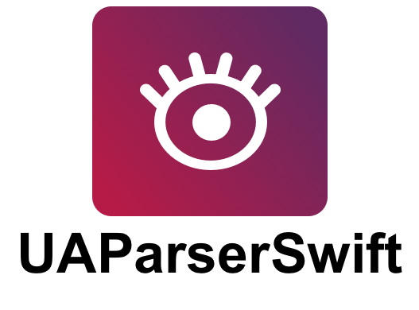

<p align="center" >
  
</p>

<p align="center"><strong>User-Agent Parser based upon ua-parser.js</strong></p>

UAParserSwift is a Swift-based library to parse User Agent string; it's a port of [ua-parser-js](https://github.com/faisalman/ua-parser-js) by Faisal Salman created to be mainly used in Swift Server Side applications ([Kitura](http://kitura.io), [Vapor](https://opencollective.com/vapor) etc.).
You can however use it on client side, all Apple's platforms are supported (iOS, macOS, tvOS and watchOS).

This library aims to identify detailed type of web browser, layout engine, operating system, cpu architecture, and device type/model, entirely from user-agent string with a relatively small footprint.

## ❤️ Your Support

*Hi fellow developer!*  
You know, maintaing and developing tools consumes resources and time. While I enjoy making them **your support is foundamental to allow me continue its development**.  

If you are using SwiftLocation or any other of my creations please consider the following options:

- [**Make a donation with PayPal**](https://www.paypal.com/paypalme/danielemargutti/20)
- [**Become a Sponsor**](https://github.com/sponsors/malcommac)

- [Follow Me](https://github.com/malcommac)

## How it works

* [Introduction](#doc)
* [Supported Browsers](#browsers)
* [Supported Devices](#devices)
* [Supported Engines](#engines)
* [Supported OSs](#oss)
* [Supported Architectures](#architectures)

* [Unit Tests](#tests)
* [Installation](#installation)
* [License](#license)

<a name="doc"/>

## Introduction

Usage of UAParserSwift is pretty simple; just allocate an `UAParser` object along with the `User-Agent` string you want to parse.

```swift
let parser = UAParser(agent: "Mozilla/5.0 (iPhone; U; CPU iPhone OS 4_0 like Mac OS X; en-us) AppleWebKit/532.9 (KHTML, like Gecko) Version/4.0.5 Mobile/8A293 Safari/6531.22.7")

// Then call properties you want to read.
// Parsed data are cached and evaluated lazily in order to
// get the best performances.

let identified_os = parser.os
let identified_device = parser.device
let identified_engine = parser.engine
let identified_os = parser.os
let identified_cpu = parser.cpu
```

Now you can call one of these properties to get parsed data (all properties are lazy created in order to keep parser lightweight):

* `.browser`: return a `Browser` object with the browser's properties: `name`, `version`
* `.device`: return a `Device` object with device's informations: `vendor`,`type`,`model`
* `.engine`: return an `Engine` object with information about browser's engine: `name`,`version`
* `.os`: return an `OS` object with the information about host operation system: `name`,`version`
* `.cpu`: return a `CPU` object with the informations about host's device architecture: `identifier`

<a name="browsers"/>

## Supported Browsers

**Name**:
```
Amaya, Android Browser, Arora, Avant, Baidu, Blazer, Bolt, Bowser, Camino, Chimera,
Chrome [WebView], Chromium, Comodo Dragon, Conkeror, Dillo, Dolphin, Doris, Edge,
Epiphany, Fennec, Firebird, Firefox, Flock, GoBrowser, iCab, ICE Browser, IceApe,
IceCat, IceDragon, Iceweasel, IE[Mobile], Iron, Jasmine, K-Meleon, Konqueror, Kindle,
Links, Lunascape, Lynx, Maemo, Maxthon, Midori, Minimo, MIUI Browser, [Mobile] Safari,
Mosaic, Mozilla, Netfront, Netscape, NetSurf, Nokia, OmniWeb, Opera [Mini/Mobi/Tablet],
PhantomJS, Phoenix, Polaris, QQBrowser, RockMelt, Silk, Skyfire, SeaMonkey, Sleipnir,
SlimBrowser, Swiftfox, Tizen, UCBrowser, Vivaldi, w3m, WeChat, Yandex
```

**Version**:
Determined dynamically

<a name="devices"/>

## Supported Devices

**Type**:

```
console, mobile, tablet, smarttv, wearable, embedded
```

**Vendor**:

```
Acer, Alcatel, Amazon, Apple, Archos, Asus, BenQ, BlackBerry, Dell, GeeksPhone,
Google, HP, HTC, Huawei, Jolla, Lenovo, LG, Meizu, Microsoft, Motorola, Nexian,
Nintendo, Nokia, Nvidia, OnePlus, Ouya, Palm, Panasonic, Pebble, Polytron, RIM,
Samsung, Sharp, Siemens, Sony[Ericsson], Sprint, Xbox, Xiaomi, ZTE
```

**Model**:
Determined dinamically

<a name="engines"/>

## Supported Engines

**Engine**:

```
Amaya, EdgeHTML, Gecko, iCab, KHTML, Links, Lynx, NetFront, NetSurf, Presto,
Tasman, Trident, w3m, WebKit
```

**Engine Version**:
Determined dinamically

<a name="oss"/>

## Supported OSs

**Name**:
```
AIX, Amiga OS, Android, Arch, Bada, BeOS, BlackBerry, CentOS, Chromium OS, Contiki,
Fedora, Firefox OS, FreeBSD, Debian, DragonFly, Gentoo, GNU, Haiku, Hurd, iOS,
Joli, Linpus, Linux, Mac OS, Mageia, Mandriva, MeeGo, Minix, Mint, Morph OS, NetBSD,
Nintendo, OpenBSD, OpenVMS, OS/2, Palm, PC-BSD, PCLinuxOS, Plan9, Playstation, QNX, RedHat,
RIM Tablet OS, RISC OS, Sailfish, Series40, Slackware, Solaris, SUSE, Symbian, Tizen,
Ubuntu, UNIX, VectorLinux, WebOS, Windows [Phone/Mobile], Zenwalk
```

**Version**:
Determined dinamically

<a name="architectures"/>

## Supported Architectures

**Identifier**:
```
68k, amd64, arm[64], avr, ia[32/64], irix[64], mips[64], pa-risc, ppc, sparc[64]
```

<a name="tests"/>

## Unit Tests

Unit Tests are available under the [`Tests`](https://github.com/malcommac/UAParserSwift/tree/master/Tests) directory; actually they are the same tests available for ua-parser-js and all are passed successfully.

<a name="installation"/>

## Installation

This library is written for Swift 4.x.

### Swift Package Manager (Vapor or any server side framework)

Meow requires Swift 4.0 or greater to work.
This is the official way to install packages for Swift Server Side.
In your Package.swift, add the following to your dependencies array:

```swift
.package(url: "https://github.com/malcommac/UAParserSwift.git", from: "1.0.1")
```

To your target, add the "UAParserSwift" dependency.

```swift
.target(name: "Application", dependencies: ["UAParserSwift", ...])
```

### CocoaPods

1.	Add the pod `UAParserSwift` to your [Podfile](http://guides.cocoapods.org/using/the-podfile.html).

```ruby
pod 'UAParserSwift'
```
Run `pod install` from Terminal, then open your app's `.xcworkspace` file to launch Xcode.

<a name="issues"/>

## Contributing

- If you **need help** or you'd like to **ask a general question**, open an issue.
- If you **found a bug**, open an issue.
- If you **have a feature request**, open an issue.
- If you **want to contribute**, submit a pull request.

<a name="license"/>

## License

Dual licensed under GPLv2 & MIT

Copyright © 2017 Daniele Margutti <hello@danielemargutti.com>
Original [ua-parser-js](http://faisalman.github.io/ua-parser-js) Copyright: Copyright © 2012-2016 Faisal Salman <fyzlman@gmail.com>

Permission is hereby granted, free of charge, to any person obtaining a copy of this software and associated documentation files (the "Software"), to deal in the Software without restriction, including without limitation the rights to use, copy, modify, merge, publish, distribute, sublicense, and/or sell copies of the Software, and to permit persons to whom the Software is furnished to do so, subject to the following conditions:

The above copyright notice and this permission notice shall be included in all copies or substantial portions of the Software.

This software is licensed under [MIT License](LICENSE.md).

**Consider ❤️ [support the development](#support) of this library!**

***Follow me on:***  
- 💼 [Linkedin](https://www.linkedin.com/in/danielemargutti/)  
- 🐦 [Twitter](https://twitter.com/danielemargutti)
